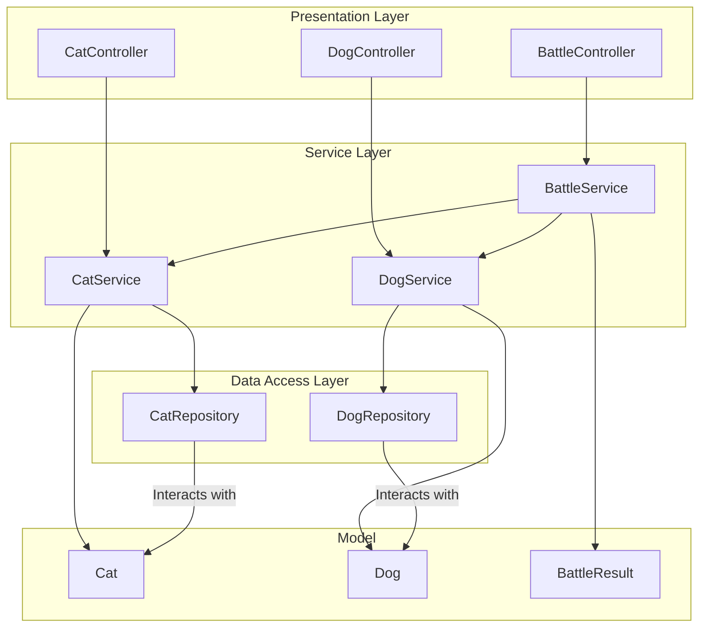

# Pet Management App

Application Spring Boot 3.5 pour gérer des chiens et des chats avec des fonctionnalités imaginatives.

## Prérequis

- Java 17
- Maven 3.6+ (ou utiliser le Maven Wrapper inclus)

## Démarrage rapide

### 1. Compiler le projet

Avec Maven Wrapper (recommandé - pas besoin d'installer Maven) :

```bash
# Windows
mvnw.cmd clean install

# Linux/Mac
./mvnw clean install
```

Ou avec Maven installé :

```bash
mvn clean install
```

### 2. Lancer l'application

```bash
# Windows
mvnw.cmd spring-boot:run

# Linux/Mac
./mvnw spring-boot:run
```

Ou directement avec Java :

```bash
java -jar target/pet-management-app-1.0.0.jar
```

L'application démarre sur **http://localhost:8080**

## Console H2

Base de données H2 en mémoire accessible via :
- URL : http://localhost:8080/h2-console
- JDBC URL : `jdbc:h2:mem:petdb`
- Username : `sa`
- Password : _(vide)_

## API Endpoints

### Chiens
- `POST /api/dogs` - Créer un chien
- `GET /api/dogs` - Lister tous les chiens
- `GET /api/dogs/{id}` - Obtenir un chien par ID
- `POST /api/dogs/{id}/play` - Jouer avec un chien
- `POST /api/dogs/{id}/feed` - Nourrir un chien
- `POST /api/dogs/{id}/teach?trick=sit` - Apprendre un tour

### Chats
- `POST /api/cats` - Créer un chat
- `GET /api/cats` - Lister tous les chats
- `GET /api/cats/{id}` - Obtenir un chat par ID
- `POST /api/cats/{id}/pet` - Caresser un chat
- `POST /api/cats/{id}/feed?food=fish` - Nourrir un chat
- `POST /api/cats/{id}/magic` - Utiliser un pouvoir magique

### Batailles
- `POST /api/battles/dog-vs-dog?dogId1=1&dogId2=2`
- `POST /api/battles/cat-vs-cat?catId1=1&catId2=2`
- `POST /api/battles/cat-vs-dog?catId=1&dogId=1`

## Fonctionnalités

### Chiens
- Système de loyauté et d'énergie
- Pouvoirs spéciaux (vitesse, force)
- Apprentissage de tours
- Combat avec stats d'attaque/défense

### Chats
- Pouvoirs magiques
- Points de mystère et agilité
- Spots de sieste favoris
- Niveau d'indépendance

⚠️ **Note** : Cette application contient intentionnellement des bugs (NullPointerException) pour servir d'exercice de formation à l'IA.

## Technical Architecture Diagram


